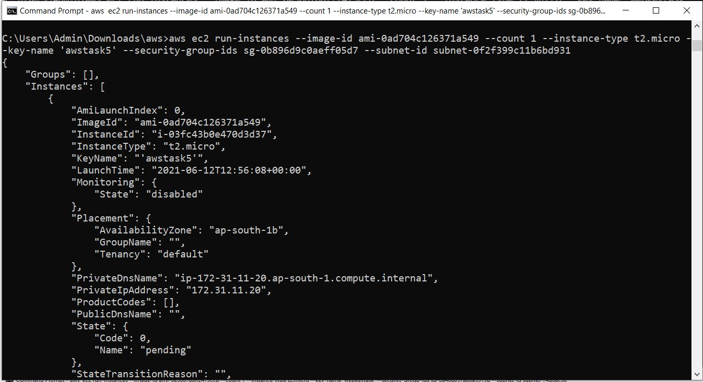
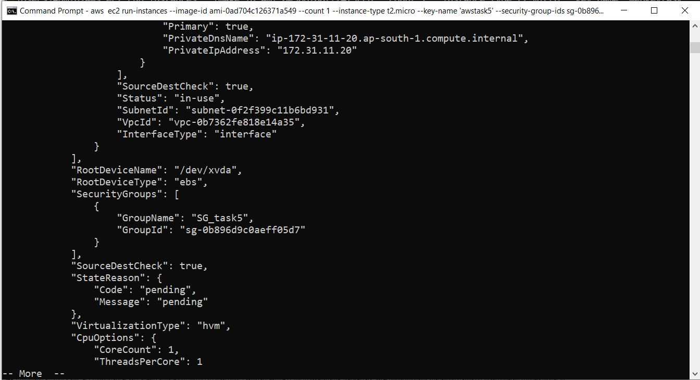
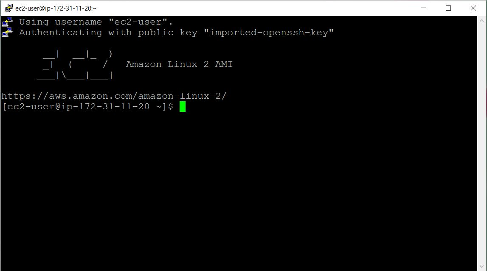
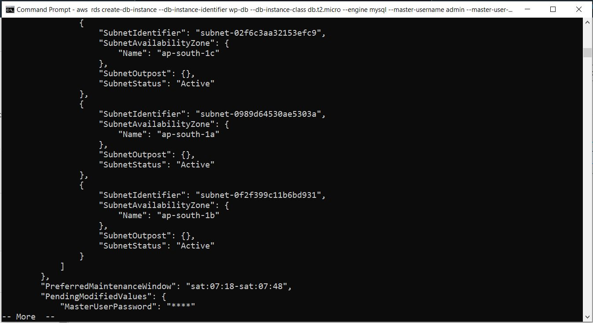

# AWSTasks

<!DOCTYPE html>
<html>
    <head>
        <title>Amazon Web Services | Task 3</title>
        <link rel="stylesheet" href="https://cdn.jsdelivr.net/npm/bootstrap@5.0.1/dist/css/bootstrap.min.css" crossorigin="anonymous">
        
    </head>
    <body>
    
           
        <h2 style="text-align: center; color: #28CCFD;">Deploy Wordpress on webserver using EC2</h2>
        

            <a href="#" class="list-group-item list-group-item-action list-group-item-info" style="margin-top: 2em;">1. First We need to configure command terminal for AWS cli -</a>
            <em><pre style="margin-left: 2em; margin-top: 0.5em; color: grey; font-size: 1em;">$ aws configure</pre></em>
            

            <a href="#" class="list-group-item list-group-item-action list-group-item-info" style="margin-top: 2em;">2. Creating Security Key Pair for SSH -</a>
            <em><pre style="margin-left: 2em; margin-top: 0.5em; color: grey; font-size: 1em;">$ aws ec2 create-key-pair --key-name 'awstask5' --output text > filename.pem</pre></em>
             
             
            
            
            <a href="#" class="list-group-item list-group-item-action list-group-item-info" style="margin-top: 2em;">3. Creating Security Group for Inbound and Outbound Traffic -</a>
            <em><pre style="margin-left: 2em; margin-top: 0.5em; color: grey; font-size: 1em;">$ aws ec2 create-security-group --group-name SG_task5 --description AWSTASK5</pre></em>
             
            

            <a href="#" class="list-group-item list-group-item-action list-group-item-info" style="margin-top: 2em;">4. Assigning SSH : 22 and HTTP :80 inbound traffic  -</a>
            <em><pre style="margin-left: 2em; margin-top: 0.5em; color: grey; font-size: 1em;">$ aws ec2 authorize-security-group-ingress --group-name SG_task5 --protocol tcp --port 22 --cidr 0.0.0.0/0</pre></em>
            <em><pre style="margin-left: 2em; margin-top: 0.5em; color: grey; font-size: 1em;">$ aws ec2 authorize-security-group-ingress --group-name SG_task5 --protocol tcp --port 80 --cidr 0.0.0.0/0</pre></em>
             
            

            <a href="#" class="list-group-item list-group-item-action list-group-item-info" style="margin-top: 2em;">5. Launching EC2 Instance with above created Security Group and Key pair  -</a>
            <em><pre style="margin-left: 2em; margin-top: 0.5em; color: grey; font-size: 1em;">$ aws ec2 run-instances --image-id ami-0ad704c126371a549 --count 1 --instance-type t2.micro --key-name 'awstask5' --security-group-ids  sg-0b896d9c0aeff05d7 --subnet-id subnet-0f2f399c11b6bd931</pre></em>
             
             
             
             
            

            <a href="#" class="list-group-item list-group-item-action list-group-item-info" style="margin-top: 2em;">6. Retriving Public IP and Connect through PuTTY -</a>
            <em><pre style="margin-left: 2em; margin-top: 0.5em; color: grey; font-size: 1em;">$ aws ec2 describe-instances --filters "Name=image-id,Values=ami-0ad704c126371a549</pre></em>
             
            <h4>Login to EC2 instance through SSh or PuTYY</h4>
            

            <a href="#" class="list-group-item list-group-item-action list-group-item-info" style="margin-top: 2em;">7. Installation of Apache Webserver and PHP -</a>
            <em><pre style="margin-left: 2em; margin-top: 0.5em; color: grey; font-size: 1em;">$ sudo su  $ yum install httpd -y $ yum install php -y $ systemctl status httpd $ systemctl start  httpd $ systemctl enable httpd</pre></em>
             
             
             
             
            

            <a href="#" class="list-group-item list-group-item-action list-group-item-info" style="margin-top: 2em;">8. Download Wordpress, Extract and copy to WWW Directory -</a>
            <em><pre style="margin-left: 2em; margin-top: 0.5em; color: grey; font-size: 1em;">$ wget https://wordpress.org/latest.zip  $ unzip latest.zip  $ cd wordpress $ cp -r * /var/www/html</pre></em>
             
             
            

            <a href="#" class="list-group-item list-group-item-action list-group-item-info" style="margin-top: 2em;">9. Creating RDS (Free Tier) Using CMD CLI -</a>
            <em><pre style="margin-left: 2em; margin-top: 0.5em; color: grey; font-size: 1em;">$ aws rds create-db-instance --db-instance-identifier wp-db --db-instance-class db.t2.micro --engine mysql --master-username admin  --master-user-password secret99 --allocated-storage 20</pre></em>
             
             
            

            <a href="#" class="list-group-item list-group-item-action list-group-item-info" style="margin-top: 2em;">10. Connecting to RDS and creating Database for Wordpress -</a>
            <em><pre style="margin-left: 2em; margin-top: 0.5em; color: grey; font-size: 1em;">$  mysql -h wp-db.cqep3u80wt6b.ap-south-1.rds.amazonaws.com -u admin -p Enter Password:  mysql> show databases;  mysql> create database wp_db;</pre></em>
            <h4>Login to Local Linux system to access MYSQL : </h4>
             
            

            <a href="#" class="list-group-item list-group-item-action list-group-item-info" style="margin-top: 2em;">11. Setup Wordpress - </a>
            <em><pre style="margin-left: 2em; margin-top: 0.5em; color: grey; font-size: 1em;">Go to webbrowser and access the website site- http://65.0.124.236/wp-admin/setup-config.php Use database, username , password and endpoint or IP to connect and finalize setup.</pre></em>
             
             
             
             
            <h4>Website Frontend or End user Interface : </h4>
             
            <h4>Website Backend or Admin Panel : </h4>
             
        
   
    

        

    </body>
</html>
